# AI Gateway Simulator & TCO Dashboard

An interactive portfolio project simulating an **Enterprise AI Gateway** designed to control LLM spend (Total Cost of Ownership - TCO) and enforce operational controls. 

This simulator demonstrates core API-proxy patterns: **Vector-based Semantic Caching**, **Dynamic Model Routing**, **Rolling-window Rate Limiting**, and **Real-time Observability** through a web-based Next.js dashboard.

---

## 📸 Dashboard Preview

Here are the system design mockups showing the capabilities of the dashboard:

| Overview Dashboard (Ready State) | Live Traffic & Detail Drawer |
| :---: | :---: |
|  |  |

| Application Management | Demo & Operator Controls |
| :---: | :---: |
|  |  |

*(Note: These design artifacts are located locally in the [figma/](file:///Users/v1/My%20Projects%202025/Code/ai-gateway-tco-dashboard/figma) directory).*

---

## 🧠 Core Features

### 1. Vector-Based Semantic Caching
* **Exact and Near-Match Hits:** Intercepts redundant queries using a dual-check cache strategy.
  * **Exact Match:** An MD5/SHA256 hash lookup in the SQLite DB ensures instant `0ms` response times for identical queries.
  * **Semantic Match:** Generates prompt embeddings using sentence-transformers (`all-MiniLM-L6-v2`) and searches a local `FAISS` vector index using cosine similarity (default threshold: `0.90`).
* **Bypass Safe:** Requests exceeding 1,000 tokens or tagged with dynamic keywords (e.g., "real-time", "stock price") bypass the cache automatically.

### 2. Dynamic Model Routing
* **Task Classification:** Identifies task type (`faq`, `classification`, `rewrite`, `analysis`, `summarization`, `reasoning`) and prompt token count.
* **Cost & Quality Balancer:**
  * Simple/short prompts (< 250 tokens) and standard tasks route to cheaper models (`gemini-flash-class`).
  * Complex/long prompts (>= 250 tokens) and cognitive-heavy tasks (e.g., multi-page reports) route to advanced models (`gpt-4-class`).
* **Explainable Routing:** The gateway attaches a `routing_reason` header to every response, showing the exact policy rule that triggered.

### 3. App-Level Rate Limiting
* **Rolling-Window Throttling:** Enforces a rolling 60-second window rate limit (Requests Per Minute - RPM) per registered application.
* **Graceful Degradation:** Fails closed for security and quota breaches (raising `HTTP 429 Too Many Requests`), but falls back gracefully to default routing if cache index or policy components fail.

### 4. Cost Observability (TCO Dashboard)
* **Savings Tracking:** Automatically calculates and aggregates `Cost Avoided` (Baseline Projected Cost vs. Actual Cost served via cheaper routes/cached hits).
* **Live Activity Stream:** Real-time request logging with detailed slide-out drawers showing prompt inputs, response metrics, latency, and savings logs.

---

## 🏗️ System Architecture

The gateway sits as a transparent reverse proxy between client applications and downstream LLM models, logging statistics and updating vector memory.

```mermaid
sequenceDiagram
    autonumber
    actor Client as Client App
    participant GW as FastAPI Gateway
    participant Cache as FAISS Index (Vector)
    participant SQLite as SQLite Metadata DB
    participant LLM as LLM Provider (Mocked)
    participant Dashboard as Next.js Dashboard

    Client->>GW: POST /v1/chat/completions (Bearer Key)
    rect rgb(20, 20, 30)
        Note over GW: 1. Auth & Rate Limit Check
        GW->>SQLite: Check Token & rolling-window RPM limit
        SQLite-->>GW: OK (RPM < App Limit)
    end

    rect rgb(20, 30, 20)
        Note over GW: 2. Semantic Cache Lookup
        GW->>Cache: Find similar query (Threshold: 0.90)
        alt Cache Hit
            Cache-->>GW: Match found (Similarity Score)
            GW->>SQLite: Fetch cached response text
            SQLite-->>GW: Cached Payload
            GW-->>Client: Return 200 OK (Cache Hit, Latency ~0ms)
        end
    end

    rect rgb(30, 20, 20)
        Note over GW: 3. Policy Routing & Call (On Miss)
        GW->>GW: Classify Task (FAQ vs. Analysis) & Token Count
        GW->>LLM: Dispatch to routed model (Gemini-Flash or GPT-4)
        LLM-->>GW: Response Output
        GW->>Cache: Add new prompt embedding to index
        GW->>SQLite: Store response & cache metadata
    end

    GW->>SQLite: Log request (tokens, model, cost, savings, latency)
    GW-->>Client: Return 200 OK (Routed Model, Latency ~500ms)
    
    loop Real-time Polling
        Dashboard->>SQLite: GET /api/metrics/overview (every 2s)
        Dashboard->>SQLite: GET /api/requests/live (every 1s)
        SQLite-->>Dashboard: Live Metrics & Request Stream
    end
```



---

## ⚙️ Technology Stack

* **Gateway (Backend):** Python 3.11+, FastAPI, Uvicorn, SQLite
* **Embeddings & Vector Store:** HuggingFace `sentence-transformers` (`all-MiniLM-L6-v2`), FAISS (`faiss-cpu`)
* **Dashboard (Frontend):** Next.js 16 (App Router), React 19, TailwindCSS, TypeScript
* **Deployment / Isolation:** Docker, Docker Compose

---

## 🚀 Quick Start (Running Locally)

### Option A: Using Docker Compose (Recommended)
This starts both the FastAPI gateway and Next.js dashboard as isolated services in a shared network.

1. Build and run the containers:
   ```bash
   docker-compose up --build
   ```
2. Open your browser:
   * **Dashboard UI:** [http://localhost:3000](http://localhost:3000)
   * **Gateway OpenAPI Docs:** [http://localhost:8000/docs](http://localhost:8000/docs)

---

### Option B: Running Separately (Manual Setup)

#### 1. Start the Backend (Gateway)
1. Navigate to the `gateway` folder:
   ```bash
   cd gateway
   ```
2. Create and activate a Python virtual environment:
   ```bash
   python3 -m venv venv
   source venv/bin/activate
   ```
3. Install dependencies:
   ```bash
   pip install -r requirements.txt
   ```
4. Run the development server:
   ```bash
   uvicorn main:app --host 127.0.0.1 --port 8000 --reload
   ```

#### 2. Start the Frontend (Web Dashboard)
1. Navigate to the `web` folder:
   ```bash
   cd ../web
   ```
2. Install npm packages:
   ```bash
   npm install
   ```
3. Create a local environment file `.env.local` to direct traffic:
   ```bash
   echo "NEXT_PUBLIC_API_URL=http://localhost:8000" > .env.local
   ```
4. Run the Next.js development server:
   ```bash
   npm run dev
   ```
5. Open [http://localhost:3000](http://localhost:3000) in your browser.

---

## 🎭 Pre-configured Demo Scenarios

The dashboard features **Operator Controls** that trigger deterministic simulation scripts. These demonstrate different system behaviors:

| Scenario ID | Scenario Name | Triggers | Expected Outcome |
| :--- | :--- | :--- | :--- |
| `scenario_1` | **Semantic Cache Savings** | 1. "How do I reset my workspace password?"<br>2. "What is the process to change my workspace password?" | The first prompt registers a **Cache Miss**. The second similar query hits the **Semantic Cache** (Similarity ~0.95), returning in `~0ms` with `$0` actual cost. |
| `scenario_2` | **Dynamic Model Routing** | 1. Short text classification prompt.<br>2. Deep financial report analysis (~50 pages). | Prompt 1 is routed to **`gemini-flash-class`** (cheap & fast). Prompt 2 triggers analysis logic and routes to **`gpt-4-class`** (smart). |
| `scenario_3` | **Rate Limit Breach** | Sends 12 rapid queries from the `rogue-app` API key. | The API limit is set to 10 RPM. The 11th and 12th requests are rejected with **`429 Too Many Requests`** and flag an alarm on the dashboard. |
| `scenario_4` | **Cache Bypass** | Prompt: "Fetch the latest real-time stock price for AAPL" | Task classified as `live-data`, bypassing the vector cache entirely to fetch fresh data via **`gpt-4-class`**. |

---

## 📂 Project Document Directory Map

To explore the design decisions and architectural guidelines behind this project, refer to the following local product design folders (currently ignored in Git source control but accessible locally):

* **[PRD (Product Requirements Document)](file:///Users/v1/My%20Projects%202025/Code/ai-gateway-tco-dashboard/docs/product/PRD.md)**: Product goals, metrics definition, scenario details, and mock values.
* **[TDD (Technical Design Document)](file:///Users/v1/My%20Projects%202025/Code/ai-gateway-tco-dashboard/docs/product/TDD.md)**: SQLite database schemas, FAISS integration details, API signatures, and graceful degradation rules.
* **[UX Guide](file:///Users/v1/My%20Projects%202025/Code/ai-gateway-tco-dashboard/docs/product/UX_Guide.md)** & **[UI Design Guide](file:///Users/v1/My%20Projects%202025/Code/ai-gateway-tco-dashboard/docs/product/UI_Design_Guide.md)**: Interface requirements, layout specifications, and style tokens.
* **[Interview Prep Guide](file:///Users/v1/My%20Projects%202025/Code/ai-gateway-tco-dashboard/docs/product/Interview_Prep.md)**: 3-minute presentation scripts, deep-dives into edge cases, build-vs-buy analyses, and sample principal-level interview answers.
* **[Deployment Guide](file:///Users/v1/My%20Projects%202025/Code/ai-gateway-tco-dashboard/DEPLOYMENT.md)**: Step-by-step instructions on deploying the gateway backend on Render and the frontend dashboard on Vercel.
