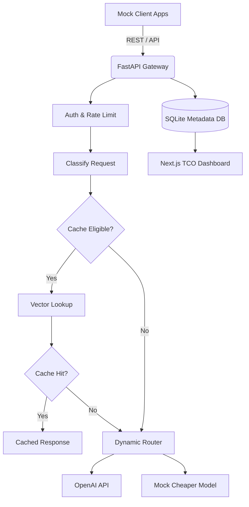

# Technical Design Document (TDD): AI Gateway Simulator

## 1. System Architecture Overview
The system is composed of a lightweight proxy gateway, a local datastore/cache, a frontend dashboard, and traffic generator scripts for simulation.

### Architecture Diagram


## 2. Concrete Technology Stack
- **Gateway Proxy:** FastAPI (Python).
- **Metadata Datastore:** SQLite (stores requests, app config, cache metadata).
- **Embeddings:** `SentenceTransformers` (`all-MiniLM-L6-v2`).
- **Vector Search:** Local FAISS index or ChromaDB for embeddings, separated from SQLite metadata.
- **Dashboard:** Next.js.
- **Traffic Generators:** Python scripts simulating different app behaviors.

## 3. Data Model Split
We separate structured metadata (SQLite) from the embedding storage (Vector Index):

### SQLite Schema
- `apps`: `app_id`, `name`, `api_key_hash`, `budget_limit`, `rpm_limit`
- `requests`: `request_id`, `timestamp`, `app_id`, `prompt`, `routing_policy`, `routing_reason`, `task_type`, `estimated_prompt_tokens`, `baseline_model`, `routed_model`, `cache_hit` (boolean), `similarity_score`, `tokens_prompt`, `tokens_completion`, `cost`, `latency`, `status_code`, `routing_savings`
- `cache_entries`: `cache_entry_id`, `app_id`, `prompt_hash`, `response`, `routed_model`, `created_at`, `expires_at`, `estimated_input_tokens`, `estimated_output_tokens`, `estimated_cost`
- `model_prices`: `model_name`, `input_price_per_1k`, `output_price_per_1k`

### Vector Index (FAISS/Chroma)
- `cache_entry_id` (used as the join key back to SQLite)
- `embedding` (the vector itself)

*Note: Because the MVP uses synthetic prompts only, raw prompts are stored in `requests.prompt` for demo explainability. A production version would redact, hash, truncate, or disable prompt storage.*

## 4. API Endpoints & Request Lifecycle

### 4.1 Exact Request Lifecycle
To ensure accurate classification before caching:
1. Validate API key.
2. Apply rate limit.
3. Normalize request.
4. Classify task type and cache eligibility.
5. If cache eligible, perform vector lookup.
6. If cache hit, return cached response and log cost avoided.
7. If cache miss or cache bypass, evaluate routing policy.
8. Call selected provider/mock model.
9. Store response in cache if eligible.
10. Log request and update metrics.

### 4.2 Gateway Proxy Endpoint (OpenAI Compatible)
- `POST /v1/chat/completions`
  - *Scope:* Non-streaming only. Chat completions only. Tool calling and embeddings endpoints are out of scope. Provider responses are normalized for dashboard logging.
  - *Provider Execution Mode (Hybrid):* Keep embeddings/vector search real, but make chat completion responses mocked by default for reliability. To support the Manual Test Console dynamically, the mock responder echoes back the manual prompt context, or real provider calls can be toggled via an environment flag.
  - *Manual Test Console Contract:* The UI uses the selected seeded app's API key and calls this endpoint directly. Exact repeated prompts from the same app explicitly produce a cache hit regardless of embedding variance, assuming the app is cache-eligible.

### 4.3 Dashboard & Demo Control APIs
```text
POST /api/demo/reset                    # Clears request logs, FAISS index, metrics. Restores default seeded apps/limits/prices.
POST /api/demo/scenarios/{id}/run       # Triggers a predefined scenario script.
POST /api/demo/cache/clear              # Purges only the vector index and cache_entries table.
POST /api/demo/prompts/{request_id}/replay # Re-sends a specific prompt to the proxy.
GET  /api/demo/report                   # Returns JSON payload of summary metrics.
GET  /api/metrics/overview              # Dashboard KPI data.
GET  /api/requests/live                 # Live stream of recent requests.
GET  /api/requests/{request_id}         # Detail drawer data.
GET  /api/apps                          # App configurations.
PATCH /api/apps/{app_id}/limits         # Updates RPM or Budget limit.
```
*Report Fields:* `total_requests`, `manual_prompt_count`, `manual_cache_hits`, `cache_hit_rate`, `actual_spend`, `estimated_baseline_spend`, `estimated_cost_avoided`, `cost_avoided`, `manual_cost_avoided`, `routing_savings`, `throttled_count`, `average_latency_ms`, `p95_latency_ms`

## 5. Core Logic & Rules

### 5.1 Dashboard Polling Strategy
- Poll `/api/metrics/overview` every 2 seconds while the simulation runs.
- Poll `/api/requests/live` every 1 second for the live request stream.
- Manual refresh triggers both endpoints immediately.

### 5.2 Routing Policy Rules
```python
if prompt.has_cache_bypass_flag():
    route_normally_skip_cache()
elif token_estimate < 250 and task_type in ["classification", "rewrite", "faq"]:
    route_to(cheap_fast_model)
elif token_estimate >= 250 or task_type in ["analysis", "summarization", "reasoning"]:
    route_to(advanced_model)
else:
    route_to(baseline_default_model)
```

### 5.3 Mock Pricing Assumptions (Per 1K Tokens)
All savings displayed are calculated strictly as estimates for the demo.
- **baseline_model** = `gpt-4-class` (Input: $0.010, Output: $0.030)
- **advanced_model** = `gpt-4-class`
- **cheap_fast_model** = `gemini-flash-class` (Input: $0.00035, Output: $0.00105)

### 5.4 Cost Calculation Formula (Token Normalized)
```text
input_cost = (tokens_prompt / 1000) * input_price_per_1k
output_cost = (tokens_completion / 1000) * output_price_per_1k
total_cost = input_cost + output_cost

cache_cost_avoided = baseline_cost_for_cached_request
routing_savings = baseline_model_cost - actual_routed_model_cost
total_estimated_cost_avoided = cache_cost_avoided + routing_savings
```

### 5.5 Graceful Degradation
The gateway **fails closed** for auth, quota, and safety controls. It **degrades gracefully** for cache and advanced routing. If the cache is unavailable, requests continue through normal provider routing. If the routing policy engine is unavailable, it defaults to the `baseline_default_model`.

## 6. Evaluation & Test Strategy
- Unit test cost calculation and token normalization logic.
- Unit test routing policy for each task type branch.
- Unit test rate limit threshold behavior.
- Integration test for semantic cache (miss then hit sequence).
- Integration test verifying `/api/demo/reset` clears requests but restores seed data.
- Scenario tests verifying each scenario (1-4) produces expected visible outcomes.
- Console test verifying first submit creates request row, exact repeat returns cache hit, and returns `request_id`.
- Console validation test verifying empty prompt error (live-data bypass is verified through Scenario 4).

## 7. Future Production Hardening
Out of scope for MVP:
- Auth and key rotation
- Prompt and response retention policy
- Provider data retention controls
- Distributed rate limiting
- CI/CD and deployment plan

## 8. Seed Data Contract
To ensure consistent resets, the system explicitly defines this seed data:

### Seeded Apps
| App ID            | Display Name      | API Key | RPM Limit | Budget Limit |
|-------------------|-------------------|---------|-----------|--------------|
| `support-bot`     | Support Bot       | `key_1` | 100       | $50.00       |
| `content-tool`    | Content Generator | `key_2` | 50        | $200.00      |
| `rogue-app`       | Rogue Integration | `key_3` | 10        | $5.00        |
| `live-data-query` | Live Data Agent   | `key_4` | 200       | $100.00      |

### Global Defaults
- **Cache Similarity Threshold:** 0.90
- **Routing Policy:** Balanced (Cost & Latency Optimized)
- **Provider Health:** `Operational`
- **Model Prices:** `gpt-4-class` ($0.01/$0.03), `gemini-flash-class` ($0.00035/$0.00105)
